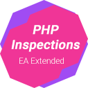

Php Inspections (EA Extended)
---

This project is an OSS Static Code Analysis [tool](https://plugins.jetbrains.com/plugin/7622-php-inspections-ea-extended-) for PhpStorm (2016.2+) and Idea Ultimate.

It covers:
- architecture related issues
- weak types control and possible code construct simplifications
- performance issues
- non-optimal, duplicate and suspicious "if" conditions
- validation of magic methods usage
- regular expressions
- validation of exception handling workflow
- compatibility issues
- variety of time-consuming bugs
- PHPUnit API usage
- security issues

Some of inspections are expecting conditional statements (e.g. "if") to use group statement for wrapping body 
expressions. If this requirement is met then additional inspections are applied to the source code.

On some projects CPU and therefore battery usage could be intensive, so it should be taken into account when traveling

Installation and getting started
---
Please follow this [documentation link](docs/getting-started.md).

Enhancing the experience
---
Once you have accommodated with the analyzer and want move to further, check [Php Inspections (EA Ultimate)](http://plugins.jetbrains.com/plugin/10215-php-inspections-ea-ultimate-) out.

Crowdfunding
---

It's also possible to support the project on [Patreon](https://www.patreon.com/kalessil) or by buying a 
[Php Inspections (EA Ultimate)](http://plugins.jetbrains.com/plugin/10215-php-inspections-ea-ultimate-) license.

This funding is used for maintaining the project and adding new features into Code Style, PHPUnit and similar inspections 
groups of Php Inspections (EA Extended).

Acknowledgments
---

 Shopware is the biggest supporter of our 2017 <a href="https://www.indiegogo.com/projects/php-inspections-ea-extended-a-code-analyzer-security#/">crowdfunding campaign</a>.

 Pixel & Tonic are supporting us since 2017.

 Cellsynt is a supporter of our 2017 <a href="https://www.indiegogo.com/projects/php-inspections-ea-extended-a-code-analyzer-security#/">crowdfunding campaign</a>.

 Roave LLC is a supporter of our 2017 <a href="https://www.indiegogo.com/projects/php-inspections-ea-extended-a-code-analyzer-security#/">crowdfunding campaign</a>.

 Syrcon GmbH is a supporter of our 2017 <a href="https://www.indiegogo.com/projects/php-inspections-ea-extended-a-code-analyzer-security#/">crowdfunding campaign</a>.

 YourKit supports us with their full-featured [Java Profiler](https://www.yourkit.com/java/profiler/).

JetBrains supports us with their awesome IDEs.

Project activity and various stats: https://www.openhub.net/p/phpinspectionsea
