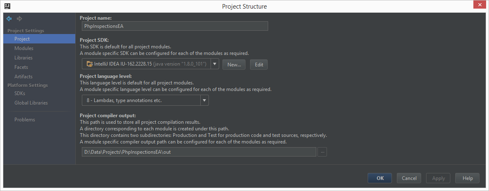
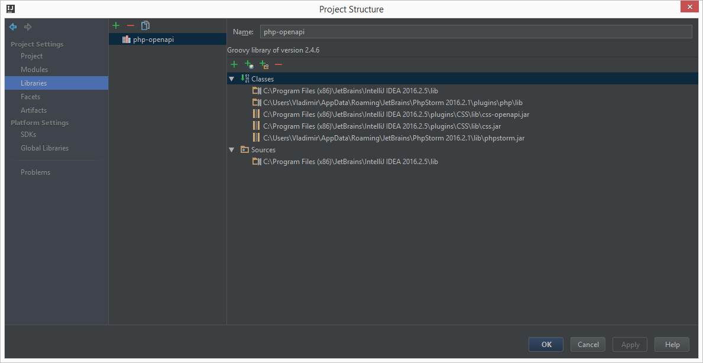
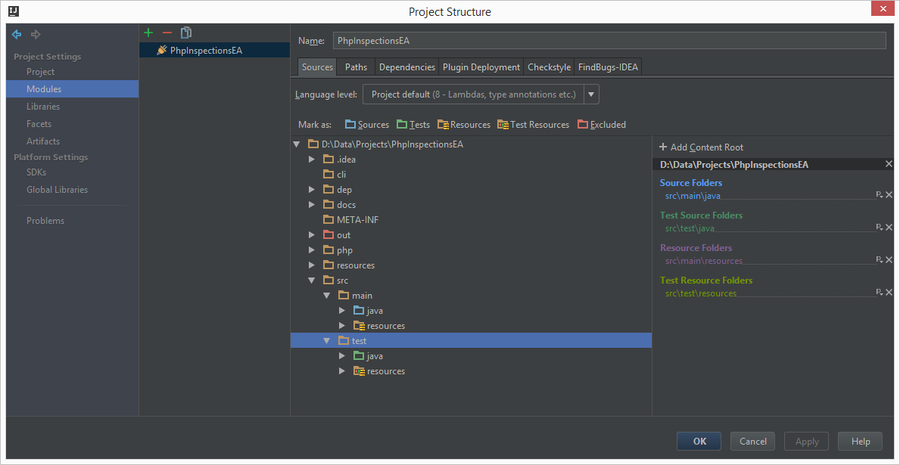
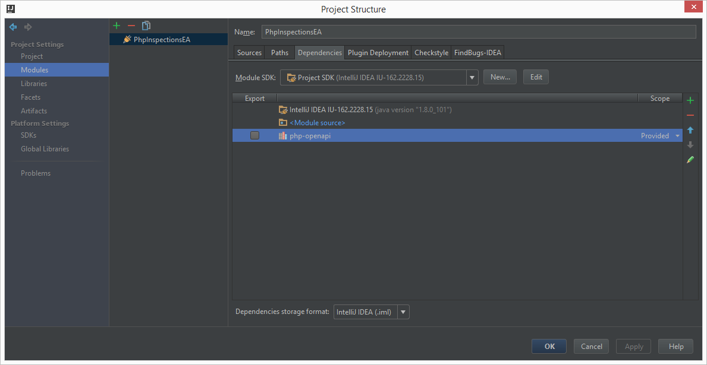
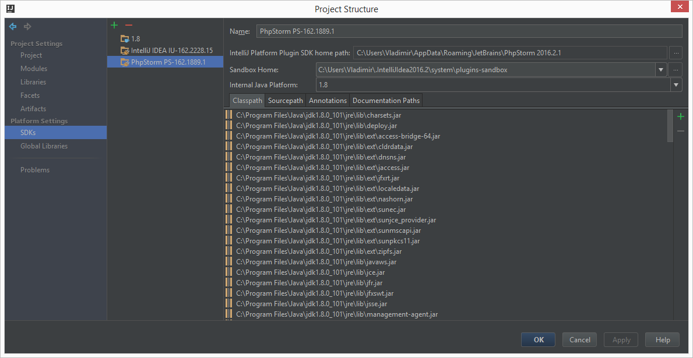
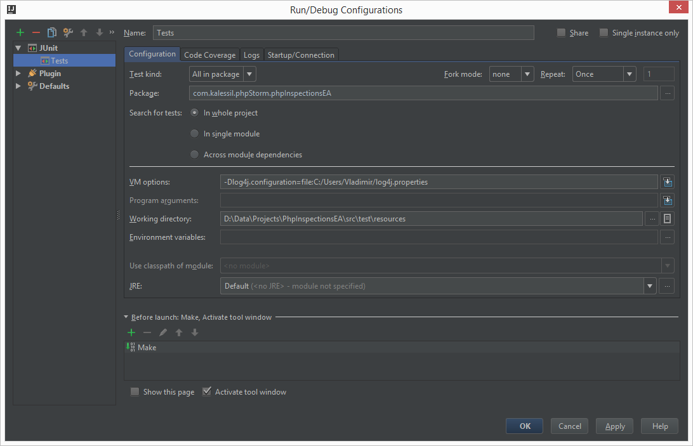

# Developer docs
Helps with setting up the project and running tests.

## Setting up the project

### Pre-requisites

- Java 8 **SDK** SE
- Intellij Idea Ultimate (for running Unit Tests)
- PhpStorm 2016.2.1 (for PHP-related SDK)

> Note: alternatively you can add PHP plugin to IDEA and use it instead. Some test might fail in this case.

### Checking out project

- Fork https://github.com/kalessil/phpinspectionsea on Github
- In IDE: VCS -> Checkout from Version Control -> Git
  - Provide url, e.g. https://github.com/<your_github_account>/phpinspectionsea.git
  - IDE will suggest opening a folder after checking source code out

### Known issues

Classes responsibility are not separated: inspections are also generating replacements and containing inner QF classes.

### Configuring project

- Rename file: `PhpInspectionsEA.iml.dist` to `PhpInspectionsEA.iml`

- In IDE: File -> Project Structure
  - Project Settings -> Project
    

    If `No SDK` is initially selected, use button `New...` to add one. System installed SDK can be selected
    by choosing option `SDK` or `IntelliJ Platform Plugin SDK`, the latter is the more straightforward. If
    you choose `SDK` you may be asked to configure the internal SDK to use, locate you JDK installed in your
    system then.

    If no output directory is selected in `Project Compiler Output` you can configure it to point to `out` in
    the root of the project, it will be ignored by git.

  - Project Settings -> libraries (Screenshot; Idea lib, PS jar, PS PHP/CSS plugin folders)

    If there is no library, create one with the name you want; the name is important only to reference it later on.

    

    Paths to be included in the library must be:
    - `[IntelliJ Root install directory]/lib`
    - `[IntelliJ Root install directory]/plugins/CSS/lib`
    - `[PhpStorm Root install directory]/plugins/php/lib`
    - `[PhpStorm Root install directory]/lib/phpstorm.jar`

    If you use JetBrains toolbox to install IDEs, be sure to use directories where the IDE installation really is.
    Don't use the suggested directory containing `app` path since it does not contain all needed dependencies.

  - Project Settings -> Modules

    

    In the first step of the install the file `PhpInspectionsEA.iml.dist` was renamed. This created the module
    settings needed here. Be sure to use a similar setup. If needed, select folders and mark them as
    one of the categories displayed in *Mark as* section: `Sources`, `Test`, etc..

    

    For the module dependencies, select the library created in previous steps, and change the scope to `Provided`.

  - Platform Settings -> SDKs
    

    For the Platform SDK, select the SDK created in earlier steps, when configuring `Project` section.

## Configuring and running test

In IDE: Run -> Edit Configurations; add a new configuration for JUnit called "Tests" (as on screenshot):

You can use the provided `log4j.properties` in project root as default/seed configuration.

## Configuring GitHub Task Integration

You can configure IntelliJ to fetch task from GitHub:

1. Settings | Tasks | Servers
2. Add server with relevant data:
    * Username = kalessil
    * API Token = Create one for you using `Create API Token` button.
    * Repository = phpinspectionsea
    * Host = https://github.com

## Configuring spell checking dictionary

As of [this](https://youtrack.jetbrains.com/issue/IDEA-121886) IntelliJ IDEs does not support very well multiple spelling
dictionaries. If you would like to have such feature, please vote on that issue so they can take care.

For the time being use the provided file in `docs/dictionaries/kalessil.xml` to configure your dictionary located in:
`.idea/dictionaries/{username}.xml`, next time you restart the IDE, the words will be available under:
File | Settings | Spelling | Accepted Words.

Regarding the IntelliJ suggestion of installing php plugins to use with the `.php` files, IGNORE it. Most of the files used
in fixture are not valid PHP files and the IDE inspections will complain.
