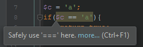
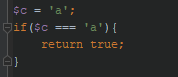
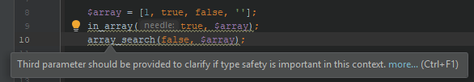
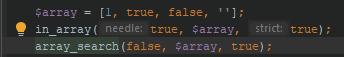

# Types compatibility

## Foreach source to iterate over

Analyzes foreach expression's data sources, which are expected to be arrays or traversable objects.
When analysis can not be performed (e.g. some methods are not annotated properly), additional
warnings are generated to resolve annotation issues:

- Types can not be checked (requests adding types information; check settings to disable this)
- Types contains `mixed` or `object` (requests re-specification of types information; check settings to disable this)
- Value can not be iterated (scalar types and classes without Iterator interface)

Risk-free refactoring involves proper annotation, but if it is truly a datasource issue, this inspection 
may reveal new bugs or dead code. Also, here are some hints how to add types information:

```php
    /* Case 1: `$items[1]` reported with `Expressions' type was not recognized, please check type hints.` message */
    
    /* @var $items string[][] <- the fix, $string type will be correctly recognized as `string` */
    preg_match_all('/.+/','.', $items); /* preg_match_all/preg_match stores results in $items */
    foreach ($items[1] as $string) {
        ...
    }
    
    /* Case 2: intended iteration over object properties */
    
    /* @var $object \stdClass */
    foreach ((array) $object as $property => $value) { /* implicit casting expresses the intention */
        ...
    }
    
    /* Case 3: complex expression iteration, when no other way is possible */

    /* @var $localVariable \stdClass[] */
    $localVariable = $object->property->property[0]; /* e.g. dynamic property from a 3rd party library */
    foreach ($localVariable as $value) {
        ...
    }
```

## 'empty(...)' usage

> Note: the inspection has settings, most of them deactivated by default

> Note: usage of 'empty(...)' still makes sense when big arrays checked for emptiness due to better performance.

> Note: more information why empty usage should be avoided: [here](https://www.toptal.com/php/10-most-common-mistakes-php-programmers-make#common-mistake-10-misusing-empty)

Here are some examples which we hope will encourage you to stop using empty at all:

```php
    /* Case 1: inconsistent data types support */
    var_dump(empty([]));                // => bool(true), as expected 
    var_dump(empty(new ArrayObject())); // => bool(false), surprise-surprise =)
    
    /* Case 2: not working as expected with magic classes */
    class RegularClass
    {
        public $property = 'value';
    }
    class MagicClass
    {
        private $values = ['property' => 'value'];
    
        public function __get($key)
        {
            if (array_key_exists($key, $this->values)) {
                return $this->values[$key];
            }
        }
        
        /* __set, __isset are omitted for demonstration purpose */
    }
    $regular = new RegularClass();
    $magic = new MagicClass();
    var_dump($regular->property);        // => string(5) "value"
    var_dump($magic->property);          // => string(5) "value"
    
    /* correctly implemented __isset resolves the issue demonstrated below */
    var_dump(empty($regular->property)); // => bool(false), as expected
    var_dump(empty($magic->property));   // => bool(true), surprise-surprise =)
```

## Strict comparison

Due to PHP's loose typing and [type juggling](http://php.net/manual/de/language.types.type-juggling.php) you
can get unexpected results when comparing two variables. More type safe operations can improve your code
and avoid you head aches. PHP7's [new features towards typing](http://php.net/manual/en/migration70.new-features.php)
shows it.

Examples illustrating the above exposed can be found [here](http://www.phptherightway.com/pages/The-Basics.html#comparison-operators). In
there you can also find relevant resources explaining how PHP comparison works.

Take into account that while loose typing in PHP is a powerful feature, as any powerful feature it needs care when dealing with it.

Example:

Code that triggers the inspection:




After applying Quick-fix:




## Strict type search in arrays

This inspection states that when the context requires strict types checking, then the third parameter flag should be used. Because
of the same explanation exposed in previous section, there will be cases in which you need to do strict type checking here.

This inspection may help avoiding bugs like this:
```php
  $array = ['a', 'b', 'c', ''];
  var_dump(in_array(false, $array)); // display true because '' is loosely evaluated to false
```

Example:

Code that triggers the inspection:




After applying Quick-fix:



